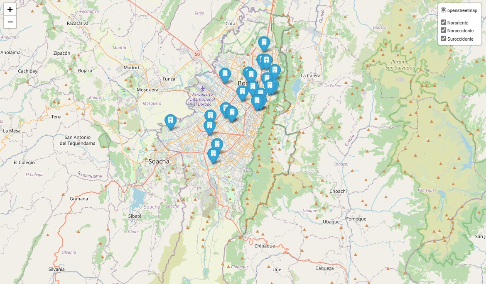
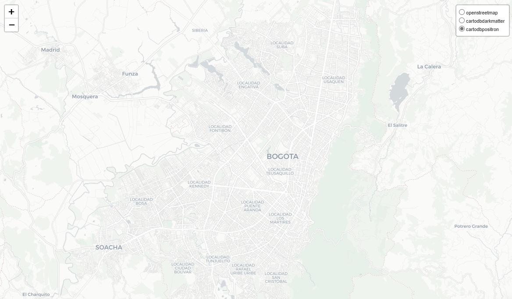
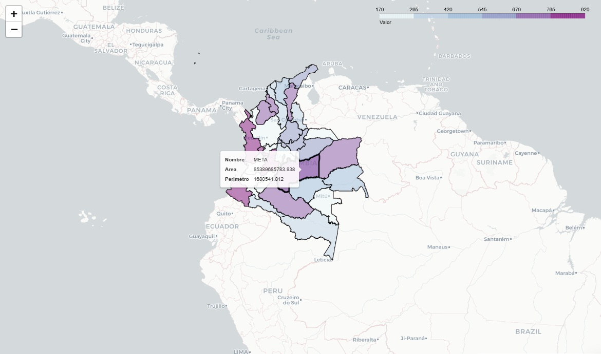

# Generación de mapas con Folium

    

## 📌Objetivo de la práctica
El objetivo de la práctica es desarrollar mapas interactivos que permitan georreferenciar y visualizar puntos de interés dentro de una zona específica. Esto incluye la identificación, representación y análisis espacial de ubicaciones claves.

## Conceptos básicos
### 💡¿Qué es georreferenciar?
Georreferenciar es el proceso de asociar datos, imágenes o elementos a una ubicación específica en la superficie terrestre mediante coordenadas geográficas. Esto permite posicionar con precisión puntos, líneas o áreas dentro de un sistema de referencia espacial, facilitando su análisis y visualización en mapas digitales o sistemas de información geográfica (SIG).

    

### 💡¿Qué es un mapa coroplético?
Un mapa coroplético es un tipo de mapa temático en el que las áreas geográficas, como regiones, municipios o países, se representan con distintos colores o patrones según un valor o categoría específica de una variable. Generalmente, estos mapas se utilizan para visualizar datos cuantitativos, como densidad de población, tasas de desempleo, nivel de ingresos o cualquier otra variable estadística asociada a una región.

    

## 📦 Descripción de los ficheros
El repositorio cuenta con los siguientes archivos:
- **Mapas.ipynb:** Cuaderno con la práctica
- **Folder data:** Contiene el dataset de los puntos a georreferenciar
- **Folder imagenes:** Contiene las imágenes usadas dentro del cuaderno

## 🛠️Dependecias para poder realizar la práctica
Para una correcta ejecución de la práctica debe instalar en su entorno las siguinetes librerías:
- folium

## 🏆 Visualice la práctica
Visualice el cuaderno en nbviewer aquí:
[Práctica: Uso de Folium](https://nbviewer.org/github/jgcarrillo0/Folium_Practica/blob/main/Cuaderno/Mapas.ipynb)
